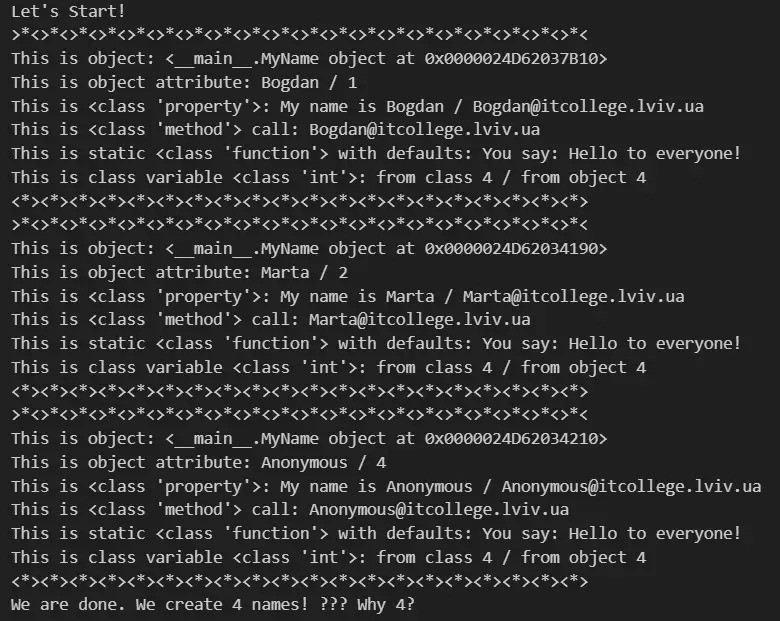
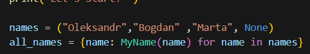
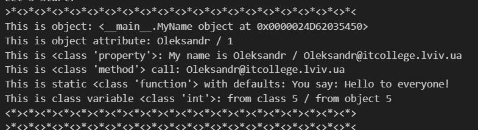

# Знайомство з ООП

### Створюємо перший class
1. Створив два python файли: для Ноутбука з розширенням `.ipynb` та для скрипта з розширенням `.py`;
1. Скопіювів Python код наведений внизу у Ваш файл з розширенням `.py` та виконайте його натиснувши `Run Python File` (трикутник :arrow_forward:); 

<details><summary> >>>>>> Python Code <<<<<< </summary>

### Перша програма на ООП
```python

class MyName:
    """Опис класу / Документація
    """
    total_names = 0 #Class Variable

    def __init__(self, name=None) -> None:
        self.name = name if name is not None else self.anonymous_user().name #Class attributes / Instance variables
        MyName.total_names += 1 #modify class variable
        self.my_id = self.total_names

    @property
    def whoami(self): 
        """Class property
        return: повертаємо імя 
        """
        return f"My name is {self.name}"
    
    @property
    def my_email(self) -> str:
        """Class property
        return: повертаємо емейл
        """
        return self.create_email()
    
    def create_email(self) -> str:
        """Instance method
        """
        return f"{self.name}@itcollege.lviv.ua"

    @classmethod
    def anonymous_user(cls):
        """Classs method
        """
        return cls("Anonymous")
    
    @staticmethod
    def say_hello(message="Hello to everyone!"):
        """Static method
        """
        return f"You say: {message}"


print("Let's Start!")

names = ("Bohdan", "Marta", None)
all_names = {name: MyName(name) for name in names}

for name, me in all_names.items():
    print(f"""{">*<"*20}
This is object: {me} 
This is object attribute: {me.name} / {me.my_id}
This is {type(MyName.whoami)}: {me.whoami} / {me.my_email}
This is {type(me.create_email)} call: {me.create_email()}
This is static {type(MyName.say_hello)} with defaults: {me.say_hello()} 
This is class variable {type(MyName.total_names)}: from class {MyName.total_names} / from object {me.total_names}
{"<*>"*20}""")

print(f"We are done. We create {me.total_names} names! ??? Why {MyName.total_names}?")

```
</details>

1. програма вивела такий результат 
;
1. Ознайомився з кодом та спробував зрозуміти за що відповідає кожен з рядків.
1. Модифікував програму додавши своє імя в список 

 



1. :star: дав відповідь на запитання: 
    - Чому коли передаємо значення `None` створюється обєкт з іменем `Anonymous`?
    - Як змінити текст привітання при виклику методу `say_hello()`? Допишіть цю частину коду.
    - Допишіть функцію в класі яка порахує кількість букв і імені (підказка: використайте функцію `len()`);
    - Порахуйте кількість імен у списку `names` та порівняйте із виведеним результатом. Дайте відповідь чому маємо різну кількість імен?
---
1. Коли передається значення None, створюється об'єкт з іменем "Anonymous", оскільки в конструкторі класу MyName виконується перевірка на None, і у випадку, якщо name є None, встановлюється значення "Anonymous".


2. Щоб змінити текст привітання при виклику методу `say_hello()`, можна передати аргумент `message` з новим текстом. Ось як виглядатиме змінений метод `say_hello()`:

```python
@staticmethod
def say_hello(message="Hello to everyone!"):
    """Static method"""
    return f"You say: {message}"
```

3. функція яка порахує кіоткісить букв і імені:

```python
def count_letters(self):
    """Instance method to count the number of letters in the name"""
    return len(self.name)
```

4. Порахуємо кількість імен у списку `names` та порівняємо з виведеним результатом:

```python
names = ("Oleksandr","Bohdan", "Marta", None)
print(f"number of names: {len(names)}")
```


5. Різна кількість імен може виникнути через те, що під час ітерації по словнику `all_names`, значення `None` буде проігноровано. Тому кількість елементів в `names` може відрізнятися від кількості об'єктів `MyName`, які фактично були створені.