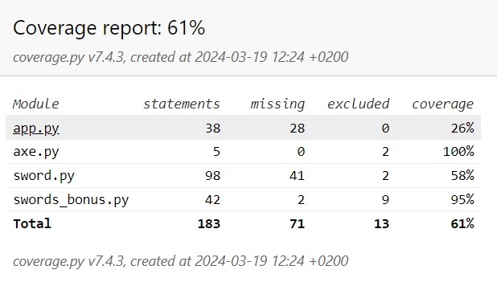

# Звіт до роботи
## Тема: _Робота з тестами в Пайтон_
### Мета роботи: _Навчитись створювати тести та за допомогою них перевіряти правильність виконання програм_

---
### Виконання роботи
* Результати виконання завданнь:
    1. Створили [Пайтон Нотбук](./nb.ipynb) де будемо працювати з базовими конструкціями для тестування;
    1. Почали використовувати твердження `assert` та продемонстрували як у нас виникає помилка при не виконання твердження 
    1. Почали використовувати бібліотеку `coverage`, потрібні команди записали у [Пайтон Нотбук](./nb.ipynb) а результат виконання покриття представляємо на скріншоті 
    1. Використали представлення покриття у вигляді HTML сторінки, де нам представлені результати 
    1. Значення покриття коду перед заданням виключення частин коду які не потрібно тестувати 
    1. Після внесення конфігурації в `.coveragerc` маємо наступні результат 
    1. Ми тепер повністю покрили нашими тестами клас  і маємо відповідний звіт 
    1. Спробували використовувати фікстури та підвищила значення покриття коду, як тепер 63% 
    1. Написана пргрма та тести є сумісними для Пайтона 3.10 та 3.11 (запустили програми та вини виконались без помилок);
    1. Познайомились з написанням тестів за допомогою `unittest` та `pytest` та протестували написану у попередній лабораторній роботі програму/гру;
    1. Навчились писати базові юніттести та проводити тестування програм;

---
### Висновок:
> ДОПИШІТЬ ВИСНОВОК:

- :question: Що зроблено в роботі;
- :question: Чи досягнуто мети роботи;
- :question: Які нові знання отримано;
- :question: Чи вдалось відповісти на всі питання задані в ході роботи;
- :question: Чи вдалося виконати всі завдання;
- :question: Чи виникли складності у виконанні завдання;
- :question: Чи подобається такий формат здачі роботи (Feedback);
- :question: Побажання для покращення (Suggestions);

---