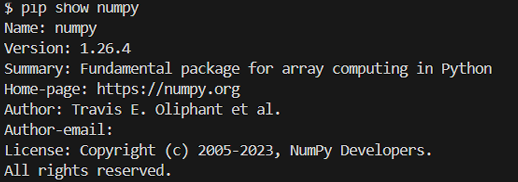
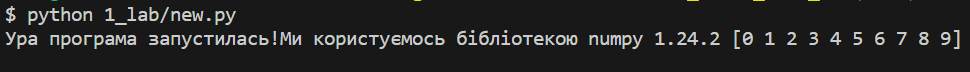
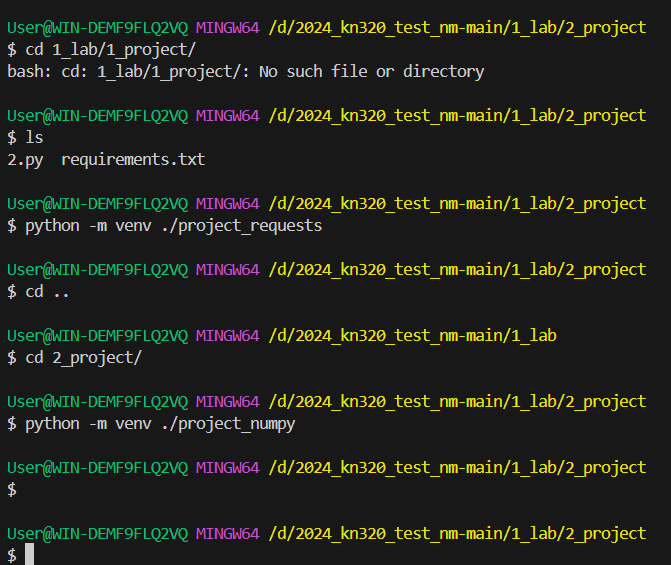
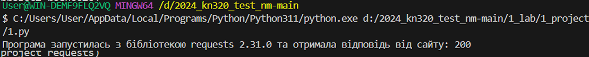
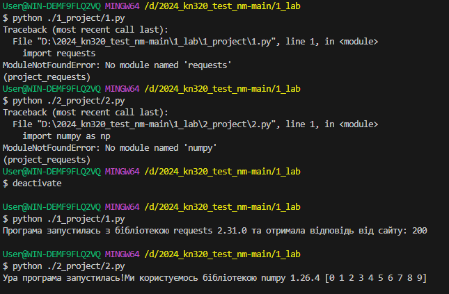
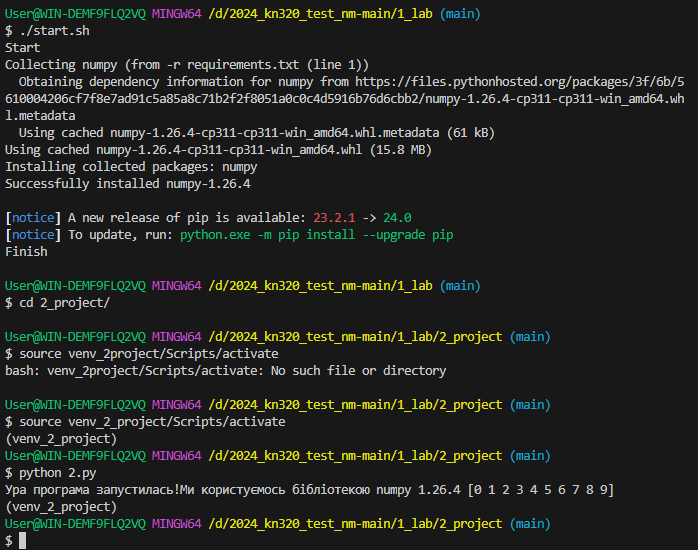
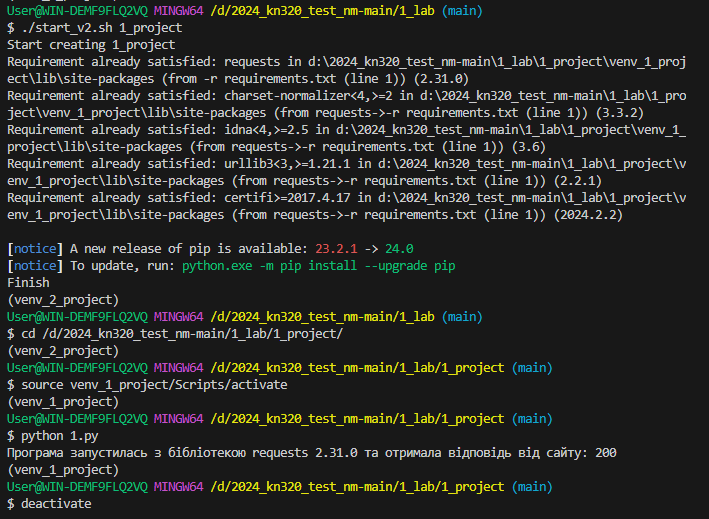
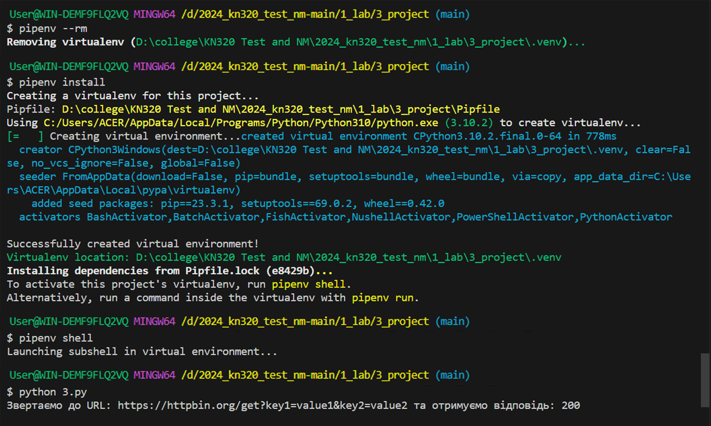

# Звіт до роботи
## Тема: _Робота у віртуальних середовищах Python_
### Мета роботи: _Навчитись створювати та працювати у віртуальних середовищах Python_

---
### Виконання роботи
* Результати виконання завдання:
    1. Розглянули що таке віртуальні середовища. Запитались у ChatGPT про пояснення:
        > `У мові програмування Python віртуальні середовища - це ізольовані області, які дозволяють управляти пакетами та залежностями для конкретних проектів без впливу на глобальне середовище Python, що встановлене на вашій системі.`
    1. Спробували інсталювати пакети за допомогою утиліти pip, для цього виконали наступні команди у терміналі:
        ```bash
        pip install numpy
        pip show numpy
        ```

        - Результат виконання команд наступний, перевірили поточну бібліотеку, її версію: 
        
        - Після цього ми змогли виконати програму на Python
        
    1. Ми створили декілька проектів які будуть потребувати різних бібліотек, які не встановлені глобально. Тому програми не будуть виконуватись якщо у нас немає віртуальних середовищ.
    1. Будемо створювати віртуальні середовища за допомогою наступних команд: 
        ```bash
        cd 1_lab/1_project/
        ls
        python -m venv ./project_requests
        cd ..
        cd 2_project/
        python -m venv ./project_numpy
        ```
        - результат виконання команд наступний
        
    1. Створили та активували проект з використання бібліотеки numpy:
        
    1. Також активували проект для requests:
        
    1. Робота з віртуальними середовищами тепер полягає у переключенні між ними, ми виконуємо активацію цих середовищ щоб мати змогу працювати з конкретним проектом. Приклад такої роботи нижче
        

    1. При копіюванні нашого репозиторію на новий ПК віртуальне середовище не буде присутнім і його потрібно кожен раз створювати. Для того, щоб автоматизувати процес створення локального віртуального середовища, ми створимо `Баш скрипт`, який знаходиться у фійлі [set-up](./1_project/set-up.sh).
        1. Для того щоб створити середовище та розпочати роботу нам потрібно:
            ```bash
            cd 1_project
            ./set-up.sh
            # Далі можемо працювати із середовищем
            source project_requests/Scripts/activate
            python 1.py
            deactivate
            ```
        1. Для середовища 2 ми використовували більш загальний метод та помістили всі потрібні середовищу бібліотеки у файл [requirements.txt](./2_project/requirements.txt) та написали новий скрипт [start.sh](./start.sh), який вже буде створювати середовище враховуючи даний файл. Для того, щоб працювати у проекті 2 нам потрібно виконати наступні команди:
            ```bash
            ./set-up.sh
            # Після цього ми можемо починати працювати у середовищі 
            cd 2_project
            source venv_2_project/Scripts/activate
            python 2.py
            deactivate
            ```
        
        1. Результат початку роботи у середовищі 2 представлено 
    1. Модифікуємо скрипт start.sh так, щоб за допомогою нього можна було створювати локальні віртуальні середовища для різних проектів. Скрипт перепишемо та переназвемо наступним чином [start_v2.sh](./start_v2.sh). 
        1. У проекті 1 ми достворили [requirements.txt](./1_project/requirements.txt) та вказали правильні бібліотеки.
        1. У [start_v2.sh](./start_v2.sh) ми зробили можливим передачу одного аргумента, який буде відповідати за назву поточної папки проекту. Тому створення віртуального середовища буде відбуватись наступним командами:
            ```bash
            # Для проекту 1 буде
            ./start_v2.sh 1_project
            # Для проекту 2 буде
            ./start_v2.sh 2_project
            ```
        1. Результат створення проекту 1 за допомогою єдиного скрипта представлено на скріншоті 
    1. Пайтонівський шлях при роботі з менеджментом проектів та їх бібліотек може використовувати таку утиліту як `pipenv` (або її конкурент `poetry`).  Ми її встановлюємо глобально та будемо використовувати для проекту 3.
        1. Виконуємо наступні команди для початкового створення середовища:
        ```bash
        pip show pipenv # перевіряємо чи в нас є ця бібліотека та її версійність
        pip install pipenv --upgrade # інсталюємо пакет та у випадку, якщо він вже є, то здійснюємо його оновлення
        # оскіль утиліта працює, переходимо у потрібну папку та будемо створювати проект
        cd 1_lab/3_project/
        # Зробимо додаткову конфігурацію, щоб наше середовище створювалось у тій самій папці, що і проект export PIPENV_VENV_IN_PROJECT=1
        pipenv --python 3.10.2 # Створюємо віртуальне середовище
        pipenv --venv # перевіряємо, де було створене віртуальне середовище
        pipenv shell
        # Після того, як зайшли в середовище, інсталюємо пакети
        pipenv install requests
        pipenv install pytest --dev
        exit # дозволяє вийти з середовища 

        
        ```
        1. Власне для початку роботи з вже налаштованим середовищем використовуємо наступні команди:
            ```bash
            pipenv --rm # видаляє середовище, але не Pipfile
            # Оскільки в нас є Pipfile ми завжди можемо відтворили наше віртуальне середовище
            pipenv install
            pipenv shell # Це активує середовище та зайде в нього, це те саме, що і source .venv/Scripts/activate
            python 3.py
            exit
            ```
        1. Результат виконання команд, а саме активація середовища та виконання в ньому програм представлено на скріншоті 
    1. Змінні середовища дозволяють нам параметризувати наше середовище передавши певні дані через пари `ключ=значення`. До прикладу створюємо такий файл у проекті 3, [.env](./3_project/.env), та вносимо змінну яка буде конфігурувати середовище pipenv, щоб його файли створювались у поточній папці. А також додамо декілька змінних, які спробуємо вичитати власне у Python програмі. 
    1. Запитались у ChatGPT як створити проект та написати мінімальний веб-сайт. Його відповідь наступна: 

---
### Відповідь ChatGPT

 Ось кроки для створення проекту на Python з         використанням бібліотеки pipenv для реалізації      простого веб-сайту на Flask з двома сторінками, index       та help:

        **Крок 1: Встановлення pipenv**
        ```bash
        pip install pipenv
        ```

        **Крок 2: Створення папки для проекту та перехід у неї**
        ```bash
        mkdir my_flask_project 
        cd my_flask_project
        # Назву ми задали по іншому
        cd 4_project/
        ```

        **Крок 3: Ініціалізація середовища pipenv**
        ```bash
        pipenv --three # Цей крок не правильний, ми використали наступну команду
        pipenv --python 3.10.2
        ```

        **Крок 4: Встановлення Flask**
        ```bash
        pipenv install flask
        ```

        **Крок 5: Створення файлу з кодом Flask**
        Створіть файл з назвою app.py та додайте наступний код:

        ```python
        from flask import Flask

        app = Flask(__name__)

        @app.route('/')
        def index():
            return '<h1>Вітаємо на головній сторінці!</h1>'

        @app.route('/help')
        def help():
            return '<h1>Вам потрібна допомога?</h1>'

        if __name__ == '__main__':
            app.run(debug=True)
        ```

        **Крок 6: Запуск веб-сервера**
        ```bash
        pipenv run python app.py
        ```

        Тепер ваш простий веб-сайт на Flask з двома сторінками, index та help, повинен бути доступним за адресою http://127.0.0.1:5000/.

---

### Висновок:

- :question: Що зроблено в роботі: Розглянуто, що таке віртуальні середовища, та робота з ними.
- :question: Чи досягнуто мети роботи: Так
- :question: Які нові знання отримано: Про віртуальні середовища, створення та робота з ними, робота з Flash
- :question: Чи вдалось відповісти на всі питання задані в ході роботи: Так
- :question: Чи вдалося виконати всі завдання: Так
- :question: Чи виникли складності у виконанні завдання: Ні, все було доступно та зрозуміло
- :question: Чи подобається такий формат здачі роботи (Feedback): Подобається, адже ти практикуєш навички в Markdown та GitHub
- :question: Побажання для покращення (Suggestions): Продовжувати в такому ж дусі.

---